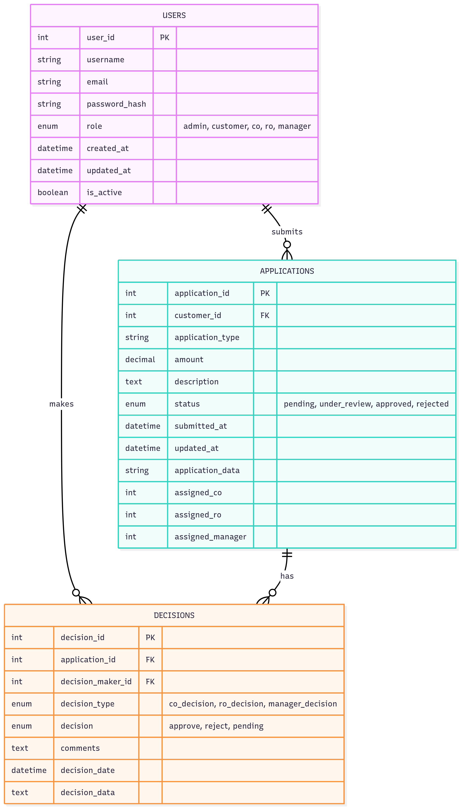

# Zaprove - Loan Approval Management Microservice

Zaprove is a robust microservices-based application designed to handle the complexities of loan approval management. It is built with a modern Java stack, featuring a suite of services that work together to provide a scalable and maintainable system. The architecture includes service discovery, centralized configuration, asynchronous messaging, and a full monitoring stack.

**Key Features • Architecture • Technologies • Getting Started • Usage • License**

---

### Key Features

*   **Microservice Architecture**: The application is broken down into logical, independently deployable services for better scalability and maintenance.
*   **Service Discovery**: Utilizes Netflix Eureka for dynamic registration and discovery of services within the ecosystem.
*   **Asynchronous Messaging**: Employs Apache Kafka for reliable, asynchronous communication between services, ensuring loose coupling and resilience.
*   **Centralized Logging**: Integrates with an ELK stack (Elasticsearch, Logstash, Kibana) for centralized log aggregation and analysis.
*   **Comprehensive Monitoring**: Features a monitoring solution with Prometheus for metrics collection and Grafana for visualization, including a pre-configured JVM dashboard.
*   **Relational Data Store**: Uses PostgreSQL for persistent data storage, managed via pgAdmin.
*   **Containerized Deployment**: The entire application stack is containerized using Docker and orchestrated with Docker Compose for easy setup and deployment.

### Architecture

The system is composed of several microservices that communicate with each other through a combination of synchronous REST APIs and asynchronous events via Kafka.

*   **`eureka-server`**: Handles service registration and discovery, allowing services to find and communicate with each other dynamically.
*   **`core-service`**: The central service responsible for core business logic related to loan applications.
*   **`disbursement-service`**: Manages the disbursement of funds after a loan is approved.
*   **`notification-service`**: Handles sending notifications (e.g., email, SMS) to users based on events in the system.
*   **`user-role-service`**: Manages user authentication and role-based access control (RBAC).

The following diagrams provide a visual overview of the system architecture:

| ERD Diagram                               | Sequence Diagram                               | UML Diagram                               |
| ----------------------------------------- | ---------------------------------------------- | ----------------------------------------- |
|  |  |  |

### Technologies

This project is built with a range of modern technologies:

*   **Backend**: Java 21, Spring Boot 3, Spring Cloud, Spring Security, Spring Data JPA
*   **Database**: PostgreSQL
*   **Messaging**: Apache Kafka
*   **Service Discovery**: Netflix Eureka
*   **Monitoring**: Prometheus, Grafana
*   **Logging**: ELK Stack (Elasticsearch, Logstash, Kibana)
*   **Containerization**: Docker, Docker Compose
*   **Build Tool**: Apache Maven

### Getting Started

To get the full application stack running, you will need **Docker** and **Docker Compose** installed on your machine.

**1. Environment Configuration**

Before starting, you need to create a `.env` file in the project root directory. This file will hold the necessary credentials for services like PostgreSQL and pgAdmin.

Create a file named `.env` and add the following content:

```env
# PostgreSQL
POSTGRES_DB=zaprove_db
POSTGRES_USER=admin
POSTGRES_PASSWORD=secret

# pgAdmin
PGADMIN_DEFAULT_EMAIL=admin@example.com
PGADMIN_DEFAULT_PASSWORD=admin
```

**2. Build the Services**

Each Java-based microservice needs to be packaged into a JAR file before it can be built into a Docker image. The included Maven wrapper (`mvnw`) simplifies this process.

Run the following commands from the project's root directory to build each service:

```bash
# For Windows
cd core && mvnw.cmd clean install -DskipTests && cd ..
cd disbursement-service && mvnw.cmd clean install -DskipTests && cd ..
cd notification-service && mvnw.cmd clean install -DskipTests && cd ..
cd eureka-server && mvnw.cmd clean install -DskipTests && cd ..

# For macOS/Linux
cd core && ./mvnw clean install -DskipTests && cd ..
cd disbursement-service && ./mvnw clean install -DskipTests && cd ..
cd notification-service && ./mvnw clean install -DskipTests && cd ..
cd eureka-server && ./mvnw clean install -DskipTests && cd ..
```

**3. Launch the Application**

Once the services are built, you can start the entire stack using Docker Compose:

```bash
docker-compose up -d
```

This command will build the Docker images for your services and start all the containers defined in the `docker-compose.yml` file in detached mode.

### Usage

After a successful launch, the following services and UIs will be available:

*   **Eureka Server**: `http://localhost:8761`
*   **Core Service**: `http://localhost:8081`
*   **Notification Service**: `http://localhost:8082`
*   **Disbursement Service**: `http://localhost:8083`
*   **pgAdmin**: `http://localhost:5050` (Login with credentials from `.env`)
*   **Kibana (Logging)**: `http://localhost:5601`
*   **Prometheus (Metrics)**: `http://localhost:9090`
*   **Grafana (Dashboard)**: `http://localhost:3000` (Default login: `admin`/`admin`)

The Grafana instance comes pre-configured with a Prometheus data source and a "JVM (Micrometer)" dashboard to monitor the health of your Java services.

### License

This project is licensed under the MIT License. See the [LICENSE](LICENSE) file for details.

### To Do List
- set spring cloud config server
- set spring cloud gateway
- use compose secrets (https://docs.docker.com/compose/how-tos/use-secrets/)
- run load testing with benchmark
- monitor kafka with Grafana
- reactive programming and virtual threads
- integrate keycloak


