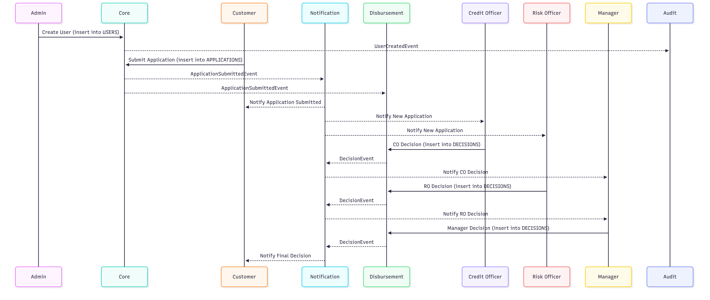

<h1 align="center">Zaprove - Loan Approval Management Microservice</h1>

[](https://www.java.com)
[](https://spring.io/projects/spring-boot)
[](https://react.dev/)
[](https://www.docker.com/)
[](https://www.postgresql.org/)
[](https://kafka.apache.org/)


<p align="center">
  <a href="#key-features">Key Features</a> •
  <a href="#architecture">Architecture</a> •
  <a href="#technologies">Technologies</a> •
  <a href="#application-details">Application Details</a> •
  <a href="#getting-started">Getting Started</a> •
  <a href="#usage">Usage</a> •
  <a href="#license">License</a>
</p>

Zaprove is a robust microservices-based application designed to handle the complexities of loan approval management. It is built with a modern Java stack, featuring a suite of services that work together to provide a scalable and maintainable system. The architecture includes service discovery, centralized configuration, asynchronous messaging, and a full monitoring stack.

### Key Features

*   **Microservice Architecture**: The application is broken down into logical, independently deployable services for better scalability and maintenance.
*   **Service Discovery**: Utilizes Netflix Eureka for dynamic registration and discovery of services within the ecosystem.
*   **Asynchronous Messaging**: Employs Apache Kafka for reliable, asynchronous communication between services, ensuring loose coupling and resilience.

*   **Comprehensive Monitoring**: Features a monitoring solution with Prometheus for metrics collection and Grafana for visualization, including a pre-configured JVM dashboard.
*   **Relational Data Store**: Uses PostgreSQL for persistent data storage, managed via pgAdmin.
*   **Containerized Deployment**: The entire application stack is containerized using Docker and orchestrated with Docker Compose for easy setup and deployment.

### Architecture

The system is composed of several microservices that communicate with each other through a combination of synchronous REST APIs and asynchronous events via Kafka.

*   **`eureka-server`**: Handles service registration and discovery, allowing services to find and communicate with each other dynamically.
*   **`core-service`**: The central service responsible for core business logic related to loan applications.
*   **`disbursement-service`**: Manages the disbursement of funds after a loan is approved.
*   **`notification-service`**: Handles sending notifications (e.g., email, SMS) to users based on events in the system.


The following diagrams provide a visual overview of the system architecture:

| ERD Diagram                               | Sequence Diagram                               | 
| ----------------------------------------- | ---------------------------------------------- | 
|  |  | 

### Technologies

This project is built with a range of modern technologies:

*   **Backend**: Java 21, Spring Boot 3, Spring Cloud, Spring Security, Spring Data JPA
*   **Database**: PostgreSQL
*   **Messaging**: Apache Kafka
*   **Service Discovery**: Netflix Eureka
*   **Monitoring**: Prometheus, Grafana
*   **Containerization**: Docker, Docker Compose
*   **Build Tool**: Apache Maven
*   **Frontend**: React, TypeScript, Vite, Tailwindcss
### Application Details
#### 🎭 Roles

| Role         | Description                        |
|--------------|------------------------------------|
| Admin        | Creates users                      |
| Customer     | Submits applications               |
| Credit Officer (CO) | Reviews applications initially     |
| Risk Officer (RO)   | Conducts secondary review          |
| Manager      | Approves or rejects applications   |

---

####  🧩 Services

#####  1. Core Service

Handles user management, authentication, and application submission.

**Endpoints**:
- `POST /api/v1/core/create-user` — Create user (Admin only)
- `POST /api/v1/auth/login` — Login
- `POST /api/v1/auth/logout` — Logout
- `POST /api/v1/core/loan-application` — Submit application

---

#####  2. Notification Service

Listens to Kafka topics and sends role-specific updates.

**Endpoints**:
- `GET /api/v1/notifications/customer/{userId}`
- `GET /api/v1/notifications/credit-officer/{userId}`
- `GET /api/v1/notifications/risk-officer/{userId}`
- `GET /api/v1/notifications/manager/{userId}`

---

#####  3. Disbursement Service

Handles application decisions made by CO, RO, and Manager.

**Endpoints**:

- `GET /api/v1/applications/active/credit-officer/{userId}` — View applications assigned to CO
- `GET /api/v1/applications/active/risk-officer/{userId}` — View applications assigned to RO
- `GET /api/v1/applications/active/manager/{userId}` — View applications assigned to Manager
- `POST /api/v1/decisions/credit-officer/{applicationId}`
- `POST /api/v1/decisions/risk-officer/{applicationId}`
- `POST /api/v1/decisions/manager/{applicationId}`

---

####  📡 Kafka Events

| Event                        | Topic         | Emitted By     | Consumed By               |
|-----------------------------|---------------|----------------|----------------------------|
| `UserCreatedEvent`          | `audit`       | Core           | Audit                      |
| `ApplicationSubmittedEvent` | `application` | Core           | Notification, Disbursement |
| `DecisionEvent` (CO/RO/MGR) | `decision`    | Disbursement   | Notification               |

---

####  🔄 Application Workflow

1. **Admin** creates user → emits `UserCreatedEvent`
2. **Customer** logs in and submits application → emits `ApplicationSubmittedEvent`
3. **Notification** service informs Customer, CO, and RO of the new application
4. **Credit Officer (CO)** gives verdict → emits `DecisionEvent` → notifies Manager
5. **Risk Officer (RO)** gives verdict → emits `DecisionEvent` → notifies Manager
6. **Manager** gives final verdict → emits `DecisionEvent` → notifies Customer
7. Application lifecycle ends after Customer receives final decision

#### Monitoring
You can import this dashboard to see your project.
https://grafana.com/dashboards/11378


### Getting Started

To get the full application stack running, you will need **Docker** and **Docker Compose** installed on your machine.

**1. Environment Configuration**

Before starting, you need to create a `.env` file in the project root directory. This file will hold the necessary credentials for services like PostgreSQL and kafka.

For the simplicity of the project I have used the free services from Aiven (https://aiven.io/)


**2. Launch the Application**

Once the services are built, you can start the entire stack using Docker Compose:

```bash
docker-compose up -d
```

This command will build the Docker images for your services and start all the containers defined in the `docker-compose.yml` file in detached mode.

### Usage

After a successful launch, the following services and UIs will be available:

*   **Frontend Application**: `http://localhost:5173`
*   **Eureka Server**: `http://localhost:8761`
*   **Core Service**: `http://localhost:8081`
*   **Notification Service**: `http://localhost:8082`
*   **Disbursement Service**: `http://localhost:8083`
*   **Prometheus (Metrics)**: `http://localhost:9090`
*   **Grafana (Dashboard)**: `http://localhost:3000` (Default login: `admin`/`admin`)

The Grafana instance comes pre-configured with a Prometheus data source and a "JVM (Micrometer)" dashboard to monitor the health of your Java services.
You can also [download the Postman Collection](docs/postman_collection.json) to check each individual endpoint.

### License

This project is licensed under the MIT License. See the [LICENSE](LICENSE) file for details.

### Future Work List
- set spring cloud config server
- set spring cloud gateway
- reactive programming and virtual threads
- integrate keycloak
- ELK stack
- deploy in ec2 server with kubernetes
- manual kafka configuration with docker, monitor with provectus kafka ui.